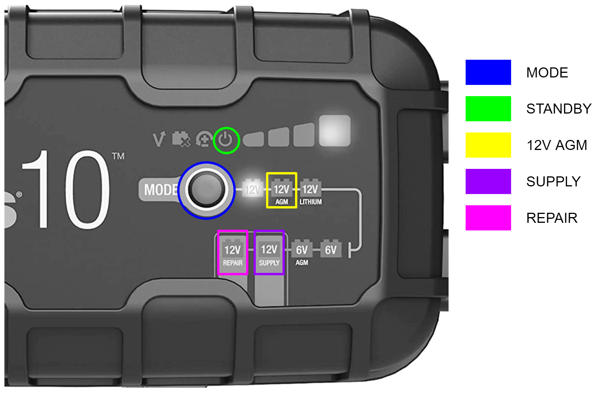
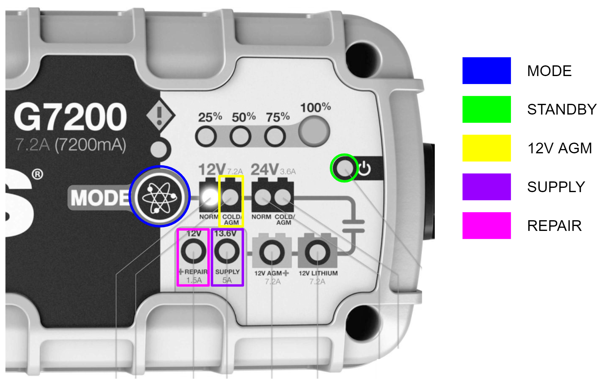

# Battery Maintenance Guide - Stretch RE1

## Overview

Stretch RE1 utilizes two [12V AGM SLA batteries](https://www.power-sonic.com/product/ps-1290/) that provide a combined 18AH of capacity. Maintaining an adequate level of charge on the battery system will enhance the battery lifetime.

The run time for a fully charged system is dependent on the load use case. The majority of battery power is consumed by the NUC computer as Stretch uses relatively low power motors.

A fully charged robot running a high CPU load can run approximately 2 hours before requiring a recharge.

## Charger

Stretch ships with a NOCO Genius 10 charger. Earlier versions of Stretch use the NOCO G7200. These two chargers are functionally very similar.

Please review the battery charger user manuals prior to following the guidance in this document. 

*   [Genius 10 Manual](https://no.co/media/nocodownloads/format/g/e/genius10na_user_guide_1.pdf) 
*   [G7200 Manual](https://no.co/media/nocodownloads/format/g/7/g7200_manual_english_1.pdf)

Stretch utilizes four of the available modes on these chargers.

| Mode    | Function                                                     |
| ------- | ------------------------------------------------------------ |
| STANDBY | Charger not applying voltage to the robot                    |
| 12V AGM | Charging while robot is powered down                         |
| SUPPLY  | 1) Power the robot during tethered use 2) Repair damaged batteries. |
| REPAIR  | Repair damaged batteries.                                    |

### NOCO Genius 10 - Interface

| Mode    | Procedure                                                    |
| ------- | ------------------------------------------------------------ |
| STANDBY | Illuminates when charger not charging                        |
| 12V AGM | 1) From STANDBY, charger attached 2) Press MODE button repeatedly until 12V AGM indicator is illuminated |
| SUPPLY  | 1) From STANDBY, charger not attached 2) Press and hold MODE button for 3s 3) Attach charger 4) Press MODE button until SUPPLY indicator is illuminated |
| REPAIR  | 1) From STANDBY, charger attached 2) Press and hold MODE button for 3s 3) Press MODE button until REPAIR indicator is illuminated |

### NOCO G7200 - Interface

| Mode    | Procedure                                                    |
| ------- | ------------------------------------------------------------ |
| STANDBY | Illuminates when charger not charging                        |
| 12V AGM | 1) From STANDBY, charger attached 2) Press MODE button repeatedly until 12V AGM indicator is illuminated |
| SUPPLY  | 1) From STANDBY, charger not attached 2) Press and hold MODE button for 3s 3) Attach charger 4) Press MODE button until SUPPLY indicator is illuminated |
| REPAIR  | 1) From STANDBY, charger attached 2) Press and hold MODE button for 3s 3) Press MODE button until REPAIR indicator is illuminated |

## Charging Best Practices

It is possible to accidentally deeply discharge the batteries by leaving the robot on for long durations without the charger attached. This is similar to leaving the lights on your car where the battery will continue to drain until fully discharged.

We recommend following the best practices below to avoid deep discharge of the batteries and to ensure they have a long lifespan.

| Use Case                                                     | Best Practice                                                | Reason                                                       |
| ------------------------------------------------------------ | ------------------------------------------------------------ | ------------------------------------------------------------ |
| Robot is running an application untethered                   | 1) Regularly check the battery voltage using the command line tool.   2) Shutdown the computer and power off the robot when voltage falls below 11V.    3) Attach the charger in **12V AGM** mode.   4) Charge to 100% before resuming operation. | The 12V AGM charge mode expects the battery voltage to be above 11V in order to charge. |
| User is actively developing on the robot and robot base is not in motion | 1) Leave the charger attached in **SUPPLY** mode.  2) Shutdown and power off the robot when development is done. | When the robot is powered on its current draw can confuse the ‘smart’ charger when in 12V AGM mode. |
| Robot is not in use                                          | 1) Shutdown the computer and turn off the robot power.   2) Leave the charger attached and place it in <strong>12V AGM mode</strong>. | The charger will maintain a ‘trickle charge’ on the battery, keeping the charge at 100%.   Leaving the robot power on may cause the batteries to deep discharge. |
| Robot is coming out of storage                               | 1) Attach charger in 12V AGM mode  2) Charge for 2-3 hours until charger reports 100% | SLA batteries naturally lose charge over time due to ‘self-discharge’. |

## When To Plug in the Charger

We recommend keeping the charger attached whenever the robot is not running untethered.

When the battery voltage drops below ‘low voltage’ threshold the robot will produce an intermittent double beep sound. This is a reminder to the user to plug in the charger.

If desired, the intermittent beep functionality can be disabled by setting the `stop_at_low_voltage` field in the User YAML to `0`.

## Troubleshooting

| Issue                                                        | How to Diagnose                                              | Cause                                                        | Corrective Procedure                                         |
| ------------------------------------------------------------ | ------------------------------------------------------------ | ------------------------------------------------------------ | ------------------------------------------------------------ |
| Robot shows no power on activity                             | Nothing happens when you toggle on the robot’s power switch.   There is no visible illumination of LEDs, motion of the laser range finder, or audible noise of the robot fans. | The robot fuse may have blown.  When the batteries drain the current required to maintain power goes up, which can ultimately blow the fuse. | Proceed to “Changing the Fuse” steps below                   |
| Robot powers on momentarily                                  | When you toggle on the robot’s power switch some activity occurs  (illumination of LEDs, audible noise of robot fans, etc) but the computer fails to boot. | The battery voltage is too low to maintain power.   As the power draw increases during power-on, the voltage dips and causes the system to shut down. | Connect the battery charger in 12V AGM mode and leave until fully charged. |
| Battery won’t charge in 12V AGM mode                         | When the robot is powered down and the charger is connected in 12V AGM mode, the charger eventually switches to a different mode. | The battery voltage is too low for the charger to function correctly in normal operation. | Proceed to the “Recovering from Low Battery Voltage” steps below. |
| Charger reports 100% charge but the batteries are discharged | When the robot is powered down and the charger is connected in 12V AGM mode, the charger status shows 100%.   However the robot fails to turn on properly. | Damage to the batteries (usually caused by excessively low voltage) may artificially raise the open circuit voltage of the battery, causing the battery to appear fully charged, while providing low capacity. | Proceed to the “Recovering from Low Battery Voltage” steps below. |
| Charger will not charge or stay in any mode.                 | When placed in 12V AGM, SUPPLY, or REPAIR  mode, it continually reverts to STANDBY mode after ~ 20 minutes. | Charger may be defective.                                    | Contact Hello Robot Support for a replacement.               |

### Recovering from Low Battery Voltage

1. Turn off the robot power switch and detach the charger from the robot
2. Place charger in SUPPLY Mode 
3. Allow robot to charge for at least 3 hours
4. Switch the charger to 12V AGM mode
5. Charge until at 100%

## Additional Information

### Powering Down the Robot

The recommended power down procedure is

1. Place a clamp on the mast below the shoulder to prevent dropping
2. Shutdown the computer from the Desktop or via SSH
3. When the laser range finder has stopped spinning, turn off the main power switch

### Replacing the Fuse

Stretch RE1 has an automotive fuse inside the base that may need to be replaced. The type of fuse depends on your build version of the RE1

<table>
  <tr>
   <td><strong>Build Version</strong>
   </td>
   <td><strong>Fuse Type</strong>
   </td>
   <td><strong>Recommended Fuse</strong>
   </td>
  </tr>
  <tr>
   <td>Guthrie
   </td>
   <td>8A 5x20mm Fast Blow Glass
   </td>
   <td>Bussman S505-8-R
   </td>
  </tr>
  <tr>
   <td>Hank and later
   </td>
   <td>7.5A ATM Fast Blow Blade
   </td>
   <td>Bussman VP/ATM-7-1/2-RP
   </td>
  </tr>
</table>

The fuse location is shown below.  For guidance on replacing the fuse, contact Hello Robot support: [support@hello-robot.com](mailto:support@hello-robot.com).

>>>>>  gd2md-html alert: inline image link here (to images/image3.png). Store image on your image server and adjust path/filename/extension if necessary.  (<a href="#">Back to top</a>)(<a href="#gdcalert4">Next alert</a>) >>>>> 

### Checking the Battery Charge

The battery charger LEDs provide an approximate indicator of battery charge when it is in 12V AGM mode. 

>>>>>  gd2md-html alert: inline image link here (to images/image4.png). Store image on your image server and adjust path/filename/extension if necessary.  (<a href="#">Back to top</a>)(<a href="#gdcalert5">Next alert</a>) >>>>> 

>>>>>  gd2md-html alert: inline image link here (to images/image5.png). Store image on your image server and adjust path/filename/extension if necessary.  (<a href="#">Back to top</a>)(<a href="#gdcalert6">Next alert</a>) >>>>> 

### Checking the Battery Voltage

Battery voltage is not always an accurate indicator of battery charge but it can be a useful proxy. 

A charged battery will typically report a voltage of 12-12.8V and will maintain that voltage across load conditions. Meanwhile, a partially charged battery may report anywhere from 10-12.8V but its voltage will drop rapidly when loaded.

**Measuring Battery Voltage from the Command Line**

The battery voltage and current draw can be checked from the command line;

>>$ stretch_robot_battery_check.py 

[Pass] Voltage with 12.9889035225

[Pass] Current with 2.46239192784

[Pass] CPU Temp with 56.0

**Measuring Battery Voltage with a DMM**

When troubleshooting a deeply discharged battery it may be useful to directly measure the battery voltage with a digital multimeter (DMM). To do this we recommend detaching the charger cable at its inline connector and applying the DMM to the connector contacts as shown.

NOTE: Caution should be taken as it is possible to short the battery when doing this. 

>>>>>  gd2md-html alert: inline image link here (to images/image6.png). Store image on your image server and adjust path/filename/extension if necessary.  (<a href="#">Back to top</a>)(<a href="#gdcalert7">Next alert</a>) >>>>> 

### Repairing Damaged Batteries

It is possible for Stretch's batteries to become damaged due to repeated deep discharge. If the robot has continued issues maintaining a charge we recommend attempting the following procedure:

1. Power off the robot and plug in the charger
2. Place the charger in REPAIR mode
3. Allow robot to charge for at least 4 hours
4. Place the charger back in 12V AGM mode and allow batteries to charger to 100%

### Replacing Dead Batteries

It is possible for a mechanically skilled person to replace the Stretch batteries should it be necessary . Please contact Hello Robot Support for more information (support@hello-robot.com)

------
.
 All materials are Copyright 2020 by Hello Robot Inc. The Stretch RE1 robot has patents pending
