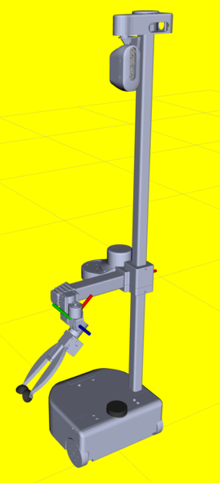
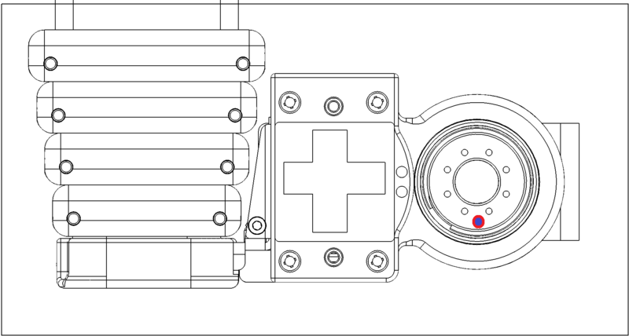

# Stretch RE1: Dex Wrist User Guide

In this guide we will cover the installation, configuration, and use of the Stretch Dex Wrist.

## Overview

The Stretch Dex Wrist is an optional add-on to the RE1. It adds pitch and roll degrees of freedom to the standard wrist yaw joint. It also includes a slightly modified version of the standard Stretch Compliant Gripper. 

**NOTE:** If your robot did not ship with the Stretch Dex Wrist pre-installed you will want to first proceed to the Appendix: Installation and Configuration at the end of this guide. 

## Functional Specification


## Working with the Dex Wrist

### Safe Use

The Dex Wrist requires added attention to safety. Its additional dexterity introduces new pinch points around the wrist pitch and roll degrees of freedom.

NOTE: Please review the [Robot Safety Guide](https://docs.hello-robot.com/robot_safety_guide/) prior to working with the Dex Wrist. 

In addition to these precautions, the Dex Wrist requires attention to pinch points between:

* The wrist pitch and wrist yaw structures during yaw motion
* The gripper and wrist pitch structures during pitch motion

The Dex Wrist includes a pinch point safety marking as a reminder to users:


### Avoiding Collisions

The added dexterity of the Dex Wrist introduces new opportunities for self-collision between the robot tool and the robot. These include

* Running the tool into the base during lift downward motion
* Running the tool into the ground
* Running the tool into the wrist yaw structure

We recommend becoming familiar with the potential collision points of the Dex Wrist by commanding careful motions through the `stretch_xbox_controller_teleop.py` tool. 

With Stretch Body v0.1.0 we introduce a [simple collision avoidance controller](https://github.com/hello-robot/stretch_body/blob/feature/collision_avoidance/body/stretch_body/robot_collision.py). 

The collision avoidance behavior acts to dynamically set the robot joint limits according to simple models of its kinematic state.  The avoidance behavior is defined in [`collision_model.py`](https://github.com/hello-robot/stretch_tool_share/blob/master/python/stretch_tool_share/stretch_dex_wrist/collision_model.py)

For performance reasons this collision avoidance behavior is coarse and does not prevent all self-collisions and considered 'experimental'. The collision avoidance is enabled by default but can be turned off (with care) by adding the following to your user YAML:

```yaml
collision_stretch_dex_wrist_to_base: 
  enabled: 0
collision_stretch_dex_wrist_to_self: 
  enabled: 0
```

### XBox Teleoperation

The Dex Wrist can be teleoperated using the XBox controller. When the Dex Wrist is installed the `stretch_xbox_controller_teleop.py` tool will automatically remap control of the pan-tilt head to control of the pitch-roll wrist.

```bash
>>$ stretch_xbox_controller_teleop.py
```

The new key mapping is shown below. A printable version is available [here](stretch_re1_dex_wrist_teleop_guide.pdf).


### Stretch Body Interface

The new [WristPitch](https://github.com/hello-robot/stretch_tool_share/blob/master/python/stretch_tool_share/stretch_dex_wrist_beta/wrist_pitch.py) and [WristRoll](https://github.com/hello-robot/stretch_tool_share/blob/master/python/stretch_tool_share/stretch_dex_wrist_beta/wrist_roll.py) joints are accessed from Stretch Body in the same manner as the [WristYaw](https://github.com/hello-robot/stretch_body/blob/master/body/stretch_body/wrist_yaw.py) joint. 

Control of the Stretch Dex Wrist uses the same interfaces as the rest of the Stretch Body Robot joints.  For example:

```python
import stretch_body.robot
robot=stretch_body.robot.Robot()
robot.startup()

#Move arm to safe manipulation location
robot.stow()
robot.lift.move_to(0.4)
robot.push_command()
time.sleep(2.0)

#Pose the Dex Wrist
robot.end_of_arm.move_to('wrist_yaw',0)
robot.end_of_arm.move_to('wrist_pitch',0)
robot.end_of_arm.move_to('wrist_roll',0)
robot.end_of_arm.move_to('stretch_gripper',50)
time.sleep(2.0)

#Go back to stow and shutdown
robot.stow()
robot.stop()

```

You can jog the individual joints of the wrist with the Stretch Body interface using the [`stretch_dex_wrist_jog.py`](https://github.com/hello-robot/stretch_tool_share/blob/feature/master/python/bin/stretch_dex_wrist_jog.py) tool that installs with the Stretch Tool Share:

```bash
>>$ stretch_dex_wrist_jog.py --pitch
>>$ stretch_dex_wrist_jog.py --yaw
>>$ stretch_dex_wrist_jog.py --roll
```

For reference, the parameters for the Stretch Dex Wrist (which can be overridden in the user YAML) can be seen in  [params.py](https://github.com/hello-robot/stretch_tool_share/blob/master/python/stretch_tool_share/stretch_dex_wrist_beta/params.py).

### Stretch ROS Interface

The Dex Wrist can be controlled via ROS as well, as shown in the [keyboard teleoperation code](https://github.com/hello-robot/stretch_ros/blob/master/stretch_core/nodes/keyboard_teleop). To test the interface:

```bash
>>$ roslaunch stretch_calibration simple_test_head_calibration.launch
```

You can type 'q' then Ctrl-C to exit when done. The menu interface is:

```bash
---------- KEYBOARD TELEOP MENU -----------|
|                                           |
|                 i HEAD UP                 |
|     j HEAD LEFT          l HEAD RIGHT     |
|                , HEAD DOWN                |
|                                           |
|                                           |
|  7 BASE ROTATE LEFT   9 BASE ROTATE RIGHT |
|         home                page-up       |
|                                           |
|                                           |
|                 8 LIFT UP                 |
|                 up-arrow                  |
|    4 BASE FORWARD         6 BASE BACK     |
|      left-arrow           right-arrow     |
|                2 LIFT DOWN                |
|                down-arrow                 |
|                                           |
|                                           |
|                 w ARM OUT                 |
|   a WRIST FORWARD        d WRIST BACK     |
|                 x ARM IN                  |
|                                           |
|                                           |
|   c PITCH FORWARD        v PITCH BACK     |
|    o ROLL FORWARD         p ROLL BACK     |
|              5 GRIPPER CLOSE              |
|              0 GRIPPER OPEN               |
|                                           |
|   step size:  b BIG, m MEDIUM, s SMALL    |
|                  q QUIT                   |
|                                           |
|-------------------------------------------|
```





## Appendix: Installation and Configuration

Robots that did not ship with the Dex Wrist installed will require additional hardware and software installation.

### Production Batch Variation

Earlier production 'batches' of Stretch will require a hardware upgrade prior to use the Dex Wrist. To check your robot's batch, run:

```bash
>>$ stretch_about.py
```

, and note the listed Batch Name.

| Batch Name        | Upgrade Wacc Board | Update Baud Rate |
| ----------------- | ------------------ | ---------------- |
| Guthrie           | Y                  | Y                |
| Irma              | Y                  | Y                |
| Hank              | Y                  | Y                |
| Joplin            | N                  | Y                |
| Kendrick or later | N                  | N                |

If your robot requires a Wacc Board upgrade please follow the [instructions here](https://github.com/hello-robot/stretch_factory/tree/master/updates/013_WACC_INSTALL) with the assistance of Hello Robot support. This must be done before attaching the Dex Wrist to our robot.

### Attaching the Dex Wrist

The Dex Wrist mounts to the bottom of the [Stretch Wrist Tool Plate](https://docs.hello-robot.com/hardware_user_guide/#wrist-tool-plate)  requires

* 8 [M2x6mm Torx FHCS bolts](https://www.mcmaster.com/90236A104/) (provided)
* 4 [M2.5x4mm Torx FHCS bolts](https://www.mcmaster.com/92703A448/) (provided)
* 2 [M2.5x8mm SHCS bolts](https://www.mcmaster.com/91290A102/) (provided)
* T6 Torx wrench (provided)
* T8 Torx wrench (provided)
* 2mm Hex key (provided)

First, remove the standard Stretch Gripper if it is still attached [according to the Hardware User Guide](https://docs.hello-robot.com/hardware_user_guide/#gripper-removal). 

#### Mounting Bracket

Note where the forward direction is on the wrist yaw tool plate. The forward direction is indicated by the  additional alignment hole that is just outside the bolt pattern (shown pointing down in the image)



Using the T6 Torx wrench, attach the wrist mount bracket to the bottom of the tool plate using the provided  M2x6mm bolts. 

**NOTE: ensure that the forward direction of the bracket (also indicated by an alignment hole) matches the forward direction of the tool plate.**


![![]](./images/dex_wrist_backet_install.PNG)

Now route the Dynamixel cable coming from the Stretch Wrist Yaw through the hollow bore of the wrist yaw joint.

Next, raise the wrist module up vertically into the mounting bracket, then sliding it over horizontally so that the bearing mates onto its post.  

**NOTE: During this step ensure the Dynamixel cable from the wrist yaw exits out the back (towards the shoulder)**


![![]](./images/dex_wrist_roll_install.png)


![![]](./images/dex_wrist_roll_install2.png)


Now rotate the wrist yaw joint so the wrist pitch servo body is accessible. Attach the pitch servo to the mounting bracket using the 4 M2.5x4mm screws at T8 Torx wrench.


Finally, plug route the Dynamixel cable into the wrist pitch servo (pink) and install the cable clip using the M2.5x8mm bolts and the 2mm hex wrench.

 


### Software Configuration

Robots that did not ship with the Dex Wrist pre-installed will require their software to be updated and configured.

#### Upgrade Stretch Body

Ensure the latest version of Stretch Body and Stretch Factory are installed

```bash
>>$ pip2 install hello-robot-stretch-body -U
>>$ pip2 install hello-robot-stretch-body-tools -U
>>$ pip2 install hello-robot-stretch-factory -U
```

#### Update Servo Baud Rates

If your robot's batch requires a baud rate update:

```bash
>>$ RE1_dynamixel_set_baud.py /dev/hello-dynamixel-head 11 115200
---------------------
Checking servo current baud for 57600
----
Identified current baud of 57600. Changing baud to 115200
Success at changing baud

>>$ RE1_dynamixel_set_baud.py /dev/hello-dynamixel-head 12 115200
---------------------
Checking servo current baud for 57600
----
Identified current baud of 57600. Changing baud to 115200
Success at changing baud

>>$ RE1_dynamixel_set_baud.py /dev/hello-dynamixel-wrist 13 115200
---------------------
Checking servo current baud for 57600
----
Identified current baud of 57600. Changing baud to 115200
Success at changing baud
```

#### Configure User YAML

The Dex Wrist requires a number of updates to the robot user YAML

YAML doesn't allow definition of multiple fields with the same name. Depending on what is already listed in your user YAML you will need to manually merge fields. 

Merge the following additions to you your  `~/stretch_user/$HELLO_FLEET_ID/stretch_re1_user_params.yaml`

```yaml

params:
  - stretch_tool_share.stretch_dex_wrist.params

robot:
  use_collision_manager: 1
  
end_of_arm:
  tool: tool_stretch_dex_wrist
  baud: 115200
head:
  baud: 115200
wrist_yaw:
  baud: 115200
head_tilt:
  baud: 115200
head_pan:
  baud: 115200

stretch_gripper:
  range_t:
    - 0
    - 6667
  zero_t: 3817
  baud: 115200

lift:
  i_feedforward: 0.75

hello-motor-lift:
  gains:
    i_safety_feedforward: 0.75

```

#### Configure for use in ROS

First pull down the latest Stretch ROS, Stretch Tool Share, and copy in the URDF data:

```bash
>>$ cd ~/catkin_ws/src/stretch_ros/
>>$ git pull

>>$ cd ~/repos
>>$ git clone https://github.com/hello-robot/stretch_tool_share
>>$ cd stretch_tool_share/tool_share/stretch_dex_wrist/stretch_description
>>$ cp urdf/stretch_dex_wrist_beta.xacro ~/catkin_ws/src/stretch_ros/stretch_description/urdf
>>$ cp meshes/*.STL ~/catkin_ws/src/stretch_ros/stretch_description/meshes
```

Now configure `stretch_description.xacro` to use the Dex Wrist:

```bash
>>$ nano ~/catkin_ws/src/stretch_ros/stretch_description/urdf/stretch_description.xacro
```

 and edit to read,

```bash
<?xml version="1.0"?>
<robot xmlns:xacro="http://www.ros.org/wiki/xacro" name="stretch_description">
  <xacro:include filename="stretch_dex_wrist_beta.xacro" />
  <xacro:include filename="stretch_main.xacro" />
  <xacro:include filename="stretch_aruco.xacro" />
  <xacro:include filename="stretch_d435i.xacro" />
  <xacro:include filename="stretch_laser_range_finder.xacro" />
  <xacro:include filename="stretch_respeaker.xacro" />
</robot>
```

Update your URDF and then export the URDF for Stretch Body to use  (you may need to Ctrl-C to exit `rosrun`)

```bash
>>$ rosrun stretch_calibration update_urdf_after_xacro_change.sh
>>$ cd ~/catkin_ws/src/stretch_ros/stretch_description/urdf
>>$ ./export_urdf.sh
```

## 

.<div align="center"> All materials are Copyright 2020 by Hello Robot Inc. The Stretch RE1 robot has patents pending</div>
