# Hardware User Guide

This manual provides the engineering data and user guidance for working with the Hello Robot Stretch RE1 hardware.  

## Disclaimer

The Hello Robot Stretch Robot is intended for use in the research of mobile manipulation applications by users experienced in the use and programming of research robots. This product is not intended for general use in the home by consumers, and lacks the required certifications for such use. Please see the section on   Regulatory Compliance for further details.

## Functional Specification

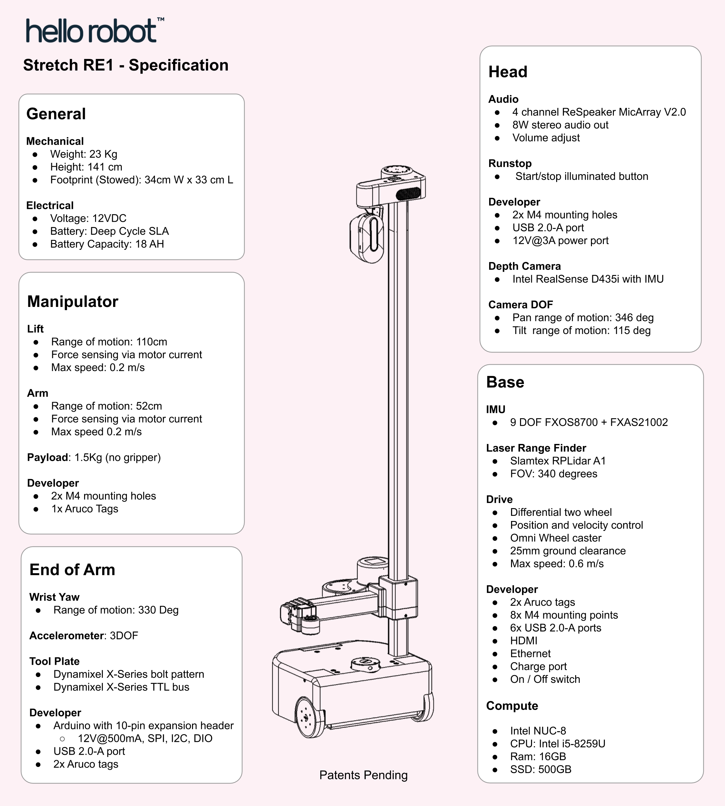


## Body Plan


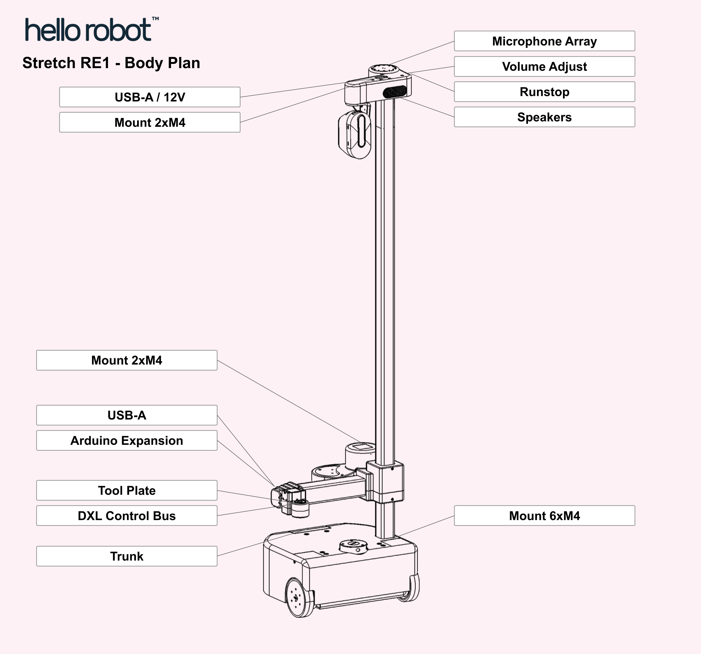

## Hardware Architecture

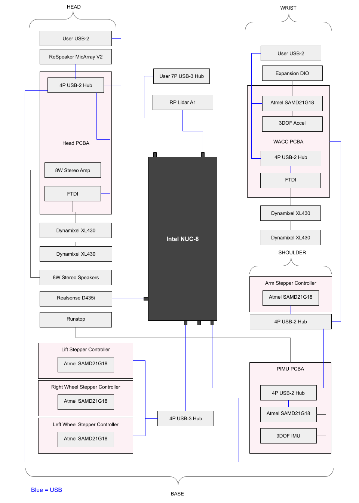

# Robot Subsystems

## Base

The base is a two wheel differential drive with a passive Mecanum wheel for a caster.  It includes four cliff sensors to allow detection of stairs, thresholds, etc.

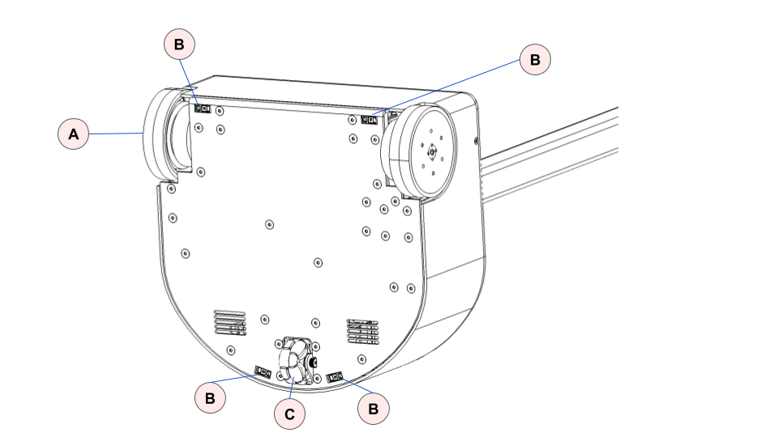

<table>
  <tr>
    <td></td>
    <td>Item</td>
    <td>Notes</td>
  </tr>
  <tr>
    <td>A</td>
    <td>Drive wheels</td>
    <td>4 inch diameter, urethane rubber shore 60A</td>
  </tr>
  <tr>
    <td>B</td>
    <td>Cliff sensors</td>
    <td>Sharp GP2Y0A51SK0F, Analog, range 2-15 cm</td>
  </tr>
  <tr>
    <td>C</td>
    <td>Mecanum wheel</td>
    <td>Diameter 50mm</td>
  </tr>
</table>


The base has 6 M4 threaded inserts available for mounting user accessories such as a tray. The mounting pattern is shown below.

The inserts are recessed 1mm from the top of the base shell.

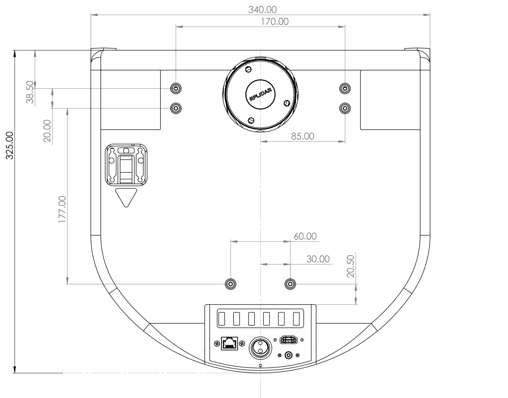


### Base IMU

The base has a 9 DOF IMU using the 9 DOF FXOS8700 + FXAS21002 chipset. The IMU orientation is as shown below:

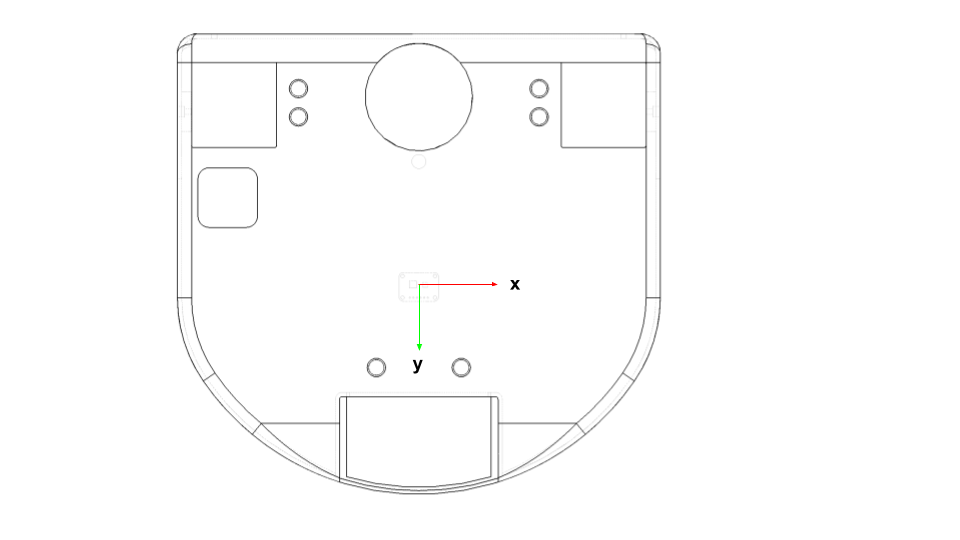

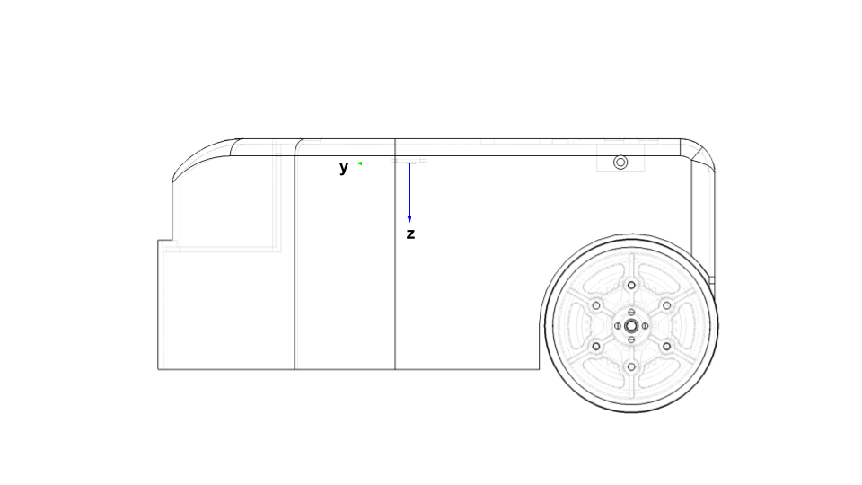

## Trunk

Development and charge ports are at the back of the base in the trunk. The trunk cover slides into place vertically and is non-latching.

The trunk height has been designed to accommodate one or more USB based Intel Neural Compute Sticks.

Two mounting holes are provided inside the trunk. These allow the user to strain relief tethered cables (eg, HDMI and keyboard) during development. It is recommended to strain relief such cables to prevent accidental damage during base motion.

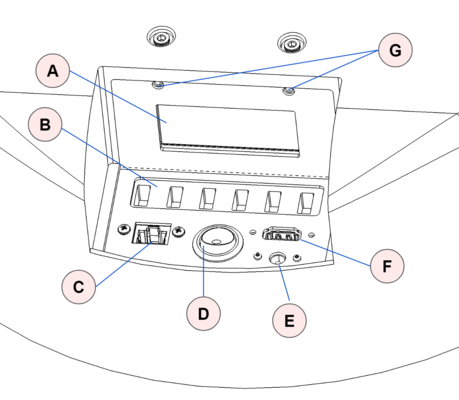

<table>
  <tr>
    <td></td>
    <td>Item</td>
    <td>Notes</td>
  </tr>
  <tr>
    <td>A</td>
    <td>Vent</td>
    <td>Intake vent for computer fan</td>
  </tr>
  <tr>
    <td>B</td>
    <td>6 Port USB Hub</td>
    <td>USB 3.0 , powered 5V/3A</td>
  </tr>
  <tr>
    <td>C</td>
    <td>Ethernet</td>
    <td>Connected to computer NIC</td>
  </tr>
  <tr>
    <td>D</td>
    <td>On/Off</td>
    <td>Robot power on / off. Switch is illuminated when on.</td>
  </tr>
  <tr>
    <td>E</td>
    <td>Charge</td>
    <td>Rated for upplied 12V/7A charger</td>
  </tr>
  <tr>
    <td>F</td>
    <td>HDMI</td>
    <td>Connected to computer HDMI</td>
  </tr>
  <tr>
    <td>G</td>
    <td>Mounting points</td>
    <td>M4 threaded holes</td>
  </tr>
</table>

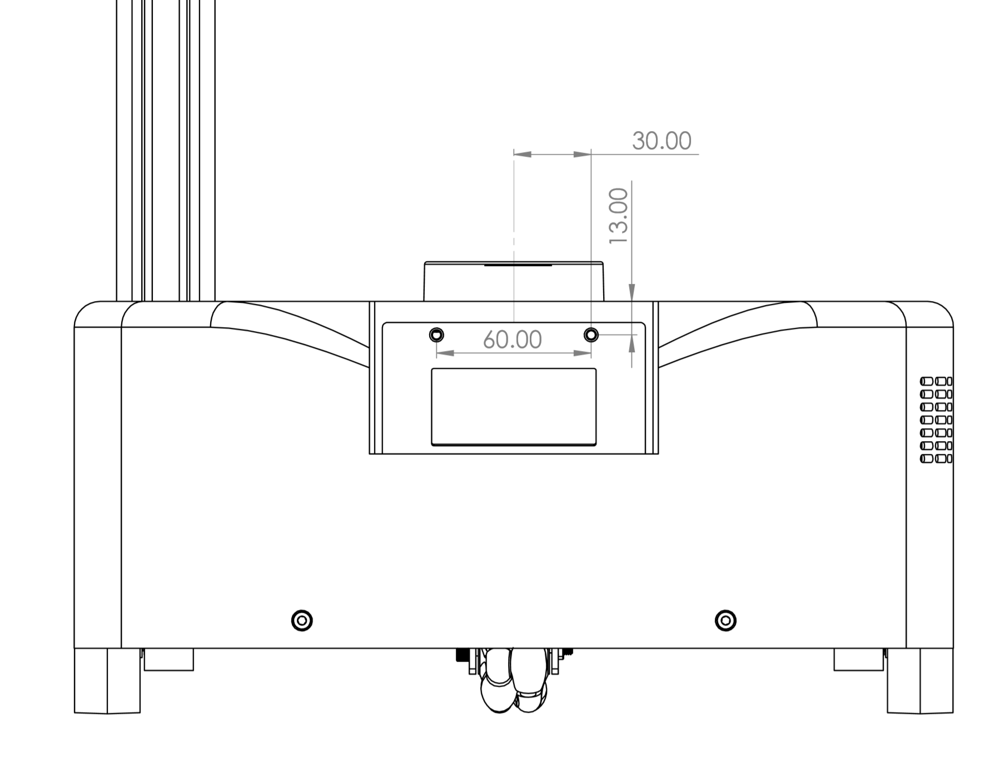

## Head

The head provides the audio interface to the robot, a pan tilt depth camera, a runstop, as well as a developer interface to allow the addition of additional user hardware.


<table>
  <tr>
    <td></td>
    <td>Item</td>
    <td>Notes</td>
  </tr>
  <tr>
    <td>A</td>
    <td>Pan tilt depth camera</td>
    <td>Intel RealSense D435i
Two Dynamixel XL430-W250-T servos</td>
  </tr>
  <tr>
    <td>B</td>
    <td>Speakers</td>
    <td></td>
  </tr>
  <tr>
    <td>C</td>
    <td>Mounting holes</td>
    <td>2x M4 threaded, spacing 25mm</td>
  </tr>
  <tr>
    <td>D</td>
    <td>Developer Interface</td>
    <td>USB2.0-A with 5V@500mA fused 
JST XHP-2,  12V@3A fused
Pin 1: 12V
Pin 2: GND</td>
  </tr>
  <tr>
    <td>E</td>
    <td>Microphone array</td>
    <td>With programmable 12 RGB LED ring </td>
  </tr>
  <tr>
    <td>F</td>
    <td>Runstop</td>
    <td></td>
  </tr>
  <tr>
    <td>G</td>
    <td>Audio volume control</td>
    <td></td>
  </tr>
</table>


### Pan Tilt

The head pan-tilt unit utilizes two Dynamixel XL430-W250-T servos. It incorporates a small fan in order to ensure proper cooling of the servo and camera during dynamic repeated motions of the tilt DOF.

The nominal ‘zero’ position is of the head is shown below, along with the corresponding range of motion.

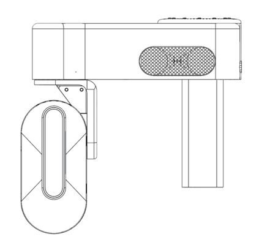

<table>
  <tr>
    <td>DOF</td>
    <td>Range (deg)</td>
    <td>Min(deg)</td>
    <td>Max (deg)</td>
  </tr>
  <tr>
    <td>Pan</td>
    <td>225</td>
    <td>-100 </td>
    <td>125</td>
  </tr>
  <tr>
    <td>Tilt</td>
    <td>115</td>
    <td>-25</td>
    <td>90</td>
  </tr>
</table>


### Runstop

The runstop allows the user to pause the motion of the four primary DOF (base, lift, and arm) by tapping the illuminated button on the head. When the runstop is enabled, these DOF are in a ‘Safety Mode’ that inhibits the motion controller at the firmware level. Disabling the runstop allows normal operation to resume. 

## Lift

The lift degree of freedom provides vertical translation of the arm. It is driven by a closed loop stepper motor, providing smooth and precise motion through a low gear-ratio belt drive. The ‘shoulder’ includes two mounting holes and a small delivery tray.

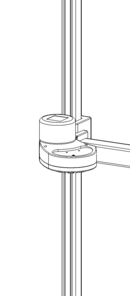


<table>
  <tr>
    <td></td>
    <td>Item</td>
    <td>Notes</td>
  </tr>
  <tr>
    <td>A</td>
    <td>Delivery tray</td>
    <td></td>
  </tr>
  <tr>
    <td>B</td>
    <td>Mounting holes</td>
    <td>Threaded M4. Spacing 34.5 mm.</td>
  </tr>
  <tr>
    <td>C</td>
    <td>Aruco Tag</td>
    <td>Size 40x40 mm</td>
  </tr>
</table>


## Arm

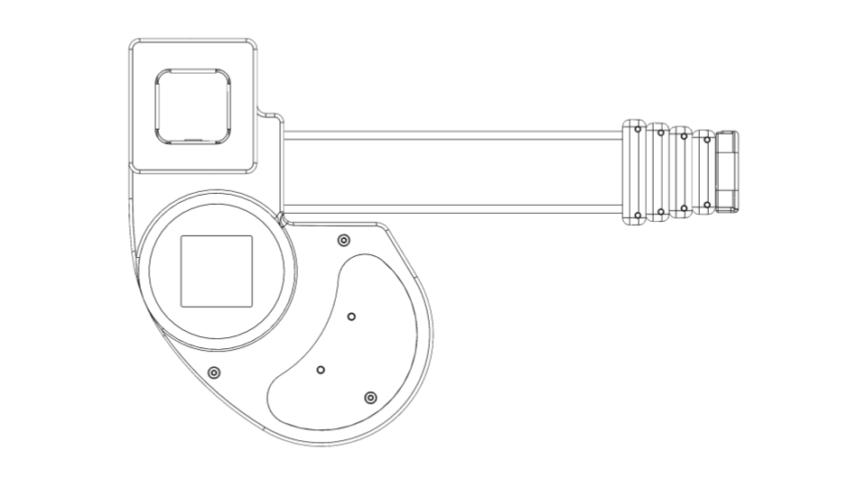

The arm comprises 5 telescoping carbon fiber links set on rollers. Its proprietary drive train is driven by a stepper motor with closed loop control and current sensing, allowing contact sensitivity during motion.

The arm exhibits a small amount of play (lash) in the X, Y, Z, and theta directions which is a normal characteristic of its design. Despite this it can achieve good repeatability, in part because its gravity loading is fairly constant.

The retracted arm and wrist combined are designed to fit within the footprint of the base. The arm is designed to have:

* Reach: 0.52m

## Wrist

The wrist includes:

* Yaw DOF to allow for stowing of the tool
* 2 Aruco tags for calibration and visual localization of the tool
* Expansion port with
  * Arduino expansion header
  * USB-A connector
* Tool plate with dual sided mounting
* Dynamixel X-Series TTL bus

### Wrist Control Interface

The wrist yaw degree-of-freedom uses a [Dynamixel XL430 servo](http://www.robotis.us/dynamixel-xl430-w250-t/). Additional Dynamixel servos can be daisy chained off of this servo, allowing for one more additional degree-of-freedoms to be easily  integrated onto the robot (such as the provided Stretch Gripper). 

Stretch comes with a XL430 compatible control cable preinstalled into this servo. If a different cable needs to be installed the servo cap can be removed as shown.

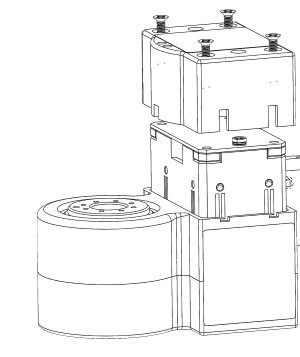

### Wrist Tool Plate

The tool plate allows for mounting on the top or the bottom using the M2 bolt pattern. The mounting pattern is compatible with Robotis Dynamixel frames as well:

* [FR12-H101K](http://www.robotis.us/fr12-h101k-set/)
* [FR12-S102K](http://www.robotis.us/fr12-s102k-set/)
* [FR12-S101K](http://www.robotis.us/fr12-s101k-set/)

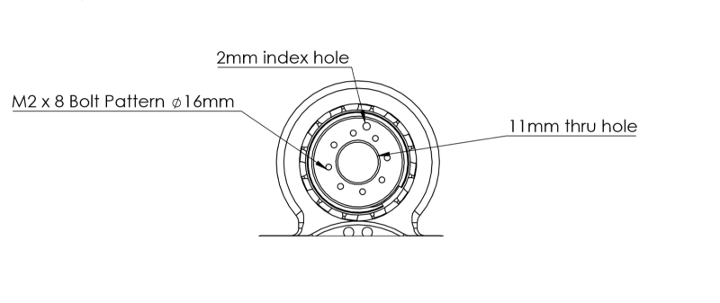

### Wrist Yaw Range of Motion

The wrist yaw DOF is calibrated so that the index hole faces forward at the 'zero' position. From this pose the wrist has a ROM of +256/-76 degrees as shown.

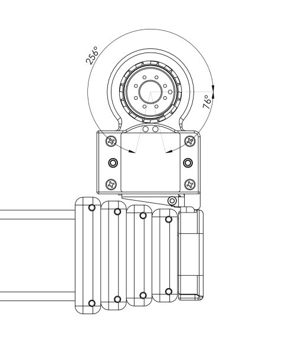

### Wrist Accelerometer

The wrist includes a 3 axis [ADXL343](https://www.analog.com/media/en/technical-documentation/data-sheets/ADXL343.pdf) accelerometer which provides bump and tap detection capabilities. The  sensor is mounted inside the distal link of the arm as shown below.

[Coming soon]

### Wrist Expansion USB

The wrist includes a USB 2.0 A interface. This power to this USB port is fused to 500mA@5V.

### Wrist Expansion Header

The wrist includes an expansion header that provides access to pins of the wrist Arduino board.  The header connector can be accessed by removing the cap at the end of the arm.

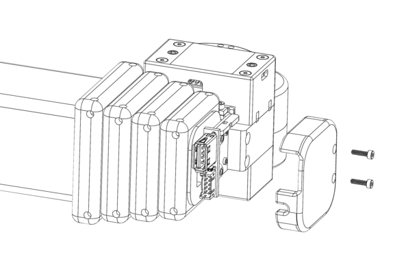

The header is wired to a Atmel SAMD21G18A-AUT ([datasheet](http://ww1.microchip.com/downloads/en/DeviceDoc/SAM_D21_DA1_Family_DataSheet_DS40001882F.pdf)) microcontroller (same as Arduino Zero). The expansion header pins are configured at the factory to allow:

* General purpose digital I/O
* Analog input

In addition, the firmware can be configured for other pin functions, including:

* Serial SPI
* Serial I2C
* Serial UART

The [Stretch Firmware Manual](https://github.com/hello-robot/stretch_firmware) covers this modification.

**The header pins utilize 3V3 TTL logic. They do not have interface protection (eg, ESD, over-voltage, shorts). It is possible to damage your robot if pin specifications are exceeded **

The pin mapping is:

<table>
  <tr>
    <td>Pin</td>
    <td>Name</td>
    <td>Function</td>
      <td>Factory Firmware</td>
  </tr>
  <tr>
    <td>1</td>
    <td>DGND</td>
    <td>Digital ground</td>
      <td></td>
  </tr>
  <tr>
    <td>2</td>
    <td>3V3</td>
    <td>3.3V supply fused at 250mA.</td>
      <td></td>
  </tr>
    <tr>
    <td>3</td>
    <td>E12V</td>
    <td>12VDC fused at 500mA</td>
        <td></td>
  </tr>
  <tr>
    <td>4</td>
    <td>SS</td>
    <td>DIO | SPI SS </td>
      <td>Digital out (D3)</td>
  </tr>
    <tr>
    <td>5</td>
    <td>SCK</td>
    <td>DIO | SPI SCK</td>
        <td>Digital out (D2)</td>
  </tr>
    <tr>
    <td>6</td>
    <td>MISO</td>
    <td>DIO | SPI MISO |UART TX</td>
        <td>Digital in (D0)</td>
  </tr>
    <tr>
    <td>7</td>
    <td>MOSI</td>
    <td>DIO | SPI MOSI</td>
        <td>Digital in (D1)</td>
  </tr>
    <tr>
    <td>8</td>
    <td>SCL</td>
    <td>DIO | I2C SCL</td>
        <td>Not used</td>
  </tr>
    <tr>
    <td>9</td>
    <td>SS</td>
    <td>DIO | I2C SDA</td>
        <td>Not used</td>
  </tr>
    <tr>
    <td>10</td>
    <td>ANA0</td>
    <td>Analog input | UART RX</td>
        <td>Analog in (A0)</td>
</table>


The expansion DIO uses a 10 pin JST header [B10B-PHDSS(LF)(SN)](https://www.digikey.com/product-detail/en/jst-sales-america-inc/B10B-PHDSS-LF-SN/455-1762-ND/926668).  It is compatible with a [JST PHDR-10VS](https://www.digikey.com/product-detail/en/jst-sales-america-inc/PHDR-10VS/455-1158-ND/608600) housing. JST provides pre-crimped wire compatible with this housing ( part [APAPA22K305](https://www.digikey.com/product-detail/en/jst-sales-america-inc/APAPA22K305/455-3086-ND/6009462)).

Pin 1 & 10 are indicated below.


The expansion DIO schematic shown below.


### Wrist Mounts

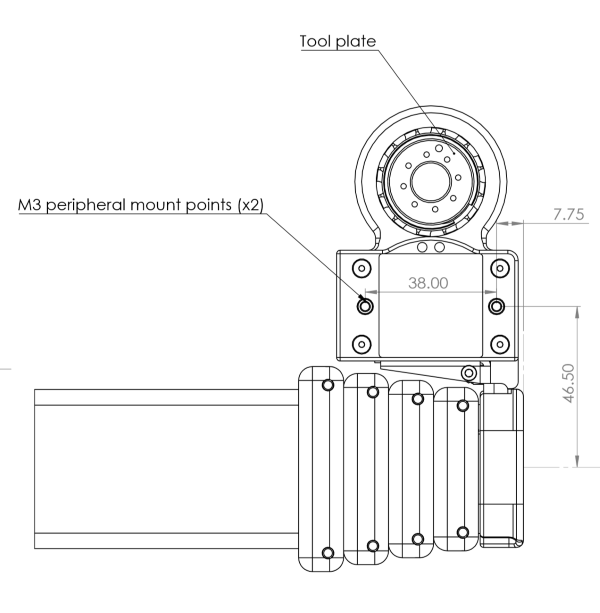


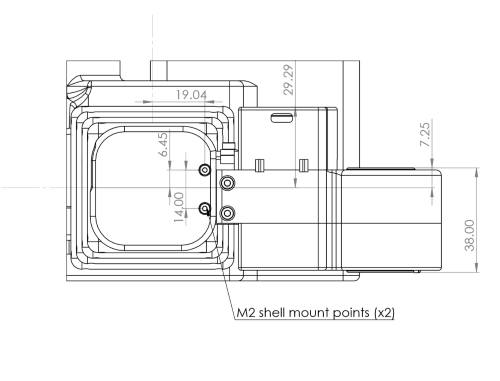

## Gripper

Coming soon.

# Robot Care 

## Battery Maintenance

The robot has two deep-cycle sealed lead acid batteries which provide 12V/19AH of charge. The provided charger will keep the system at a near full-charge if it is left plugged during non-tethered use. 

While deep-cycle batteries are robust to deep discharge states, it is recommended to avoid doing so if possible. The provide charger is able to recover form such a state if it occurs however.

We recommend leaving the charger plugged in whenever the robot base is stationary.

#### Battery State

The battery charger LEDs provide an approximate indicator of battery charge. However, this is not especially accurate. A charged battery will typically report a voltage of 12-12.8V and will maintain that voltage across load conditions. Meanwhile, a partially charged battery may report anywhere from 10-12.8V but its voltage will drop rapidly when loaded. 

The  voltage and current draw can be checked by;

```bash
>>$ stretch_robot_battery_check.py 
[Pass] Voltage with 12.9889035225
[Pass] Current with 2.46239192784
[Pass] CPU Temp with 56.0

```

#### Run Time

The run time for a fully charged system is dependent on the load use case. The vast majority of battery power is consumed by the NUC computer. While the motors can momentarily draw surge currents, the robot is designed such that minimal power is expended to hold the body up against gravity (which keeps average motor current low). 

The robot will continue to operate at battery voltages as low as 9.5V. A fully charged robot running a very high CPU load will take over 2 hours to discharge to 10V. 

#### Low Voltage Alert

When the battery voltage drops below a YAML specified threshold the robot will produce an intermittent double beep sound. This is a reminder to the user to plug in the charger. This threshold is set at 10.5V at the factory but may be overridden.

### Battery Fuse

The batteries are fused with a 20mm 8A / slow blow fuse. Nominal load currents for the robot are 3-5A for most use cases. The fuse provides protection against an internal short. 

Should the fuse blow, the robot will fail to power up. Should the fuse need replacement contact support@hello-robot.com.

## Belt Tension

A neoprene timing belt drives the arm up and down the lift. It may detension over long periods of time if it experiences sustained loading. In this case, slack will become visually apparent in the belt as the lift moves.

The belt is very straightforward to re-tension. Please contact support@hello-robot.com for tensioning instructions.

## Keeping the Robot Clean

The robot surfaces can be wiped down with an alcohol wipe or a moist rag from time to time in order to remove and debris or oils that accumulate on the shells or mast. 

The drive wheels can accumulate dust over time and begin to lose traction. They should be periodically wiped down as well.

When possible, the Trunk cover for the base should be kept on in order to keep dust and debris out of the Trunk connectors.

If the D435i camera requires cleaning use appropriate lens cleaning fluid and a microfiber cloth.

## Keeping the Robot Calibrated

The robot comes pre-calibrated with a robot-specific URDF. This calibration allows the D435i depth sensor to accurately estimate where the robot wrist, and body, is in the depth image.

The robot may become slightly uncalibrated over time for a variety of reasons:

* Normal wear and tear and loosening of joints of the robot
* The head structure is accidentally load and the structure becomes very slightly bent
* The wrist and should structure become accidentally highly loaded and become slightly bent

The calibration accuracy can be checked using the provided ROS tools. If necessary, the user can recalibrate the robot. See the [Stretch URDF Calibration Guide](https://github.com/hello-robot/stretch_ros/blob/master/stretch_calibration/README.md) for more information.

## Transporting the Robot

Stretch was designed to be easily transported in the back of a car, up a stair case, or around a building.

For short trips, the robot can be simply rolled around by grabbing its mast. It may be picked up by its mast and carried up stairs as well. 

**For safety, please use two people to lift the robot.**

For longer trips it is recommended to transport the robot in its original cardboard box with foam packaging. The metal protective cage that surrounds the head is only necessary if the robot might be shipped and the box will not remain upright.

## System Check

It is useful to periodically run stretch_robot_system_check.py. This  will check that the robot's hardware devices are  present and within normal operating conditions. 

```bash
>>$ stretch_robot_system_check.py

---- Checking Devices ----
[Pass] : hello-wacc
[Pass] : hello-motor-left-wheel
[Pass] : hello-motor-arm
[Pass] : hello-dynamixel-wrist
[Pass] : hello-motor-right-wheel
[Pass] : hello-motor-lift
[Pass] : hello-pimu
[Pass] : hello-respeaker
[Pass] : hello-lrf
[Pass] : hello-dynamixel-head

---- Checking Pimu ----
[Pass] Voltage = 12.8763639927
[Pass] Current = 3.25908634593
[Pass] Temperature = 36.3404559783
[Pass] Cliff-0 = -4.72064208984
[Pass] Cliff-1 = -8.56213378906
[Pass] Cliff-2 = 1.08505249023
[Pass] Cliff-3 = 5.68453979492
[Pass] IMU AZ = -9.80407142639


---- Checking EndOfArm ----
[Dynamixel ID:013] ping Succeeded. Dynamixel model number : 1060
[Pass] Ping of: wrist_yaw
[Pass] Calibrated: wrist_yaw

[Dynamixel ID:014] ping Succeeded. Dynamixel model number : 1060
[Pass] Ping of: stretch_gripper
[Pass] Calibrated: stretch_gripper


---- Checking Head ----
[Dynamixel ID:012] ping Succeeded. Dynamixel model number : 1060
[Pass] Ping of: head_tilt

[Dynamixel ID:011] ping Succeeded. Dynamixel model number : 1060
[Pass] Ping of: head_pan


---- Checking Wacc ----
[Pass] AX = 9.4840593338


---- Checking hello-motor-left-wheel ----
[Pass] Position = 43.9992256165


---- Checking hello-motor-right-wheel ----
[Pass] Position = 15.1164712906


---- Checking hello-motor-arm ----
[Pass] Position = 59.7719421387
[Pass] Position Calibrated = True


---- Checking hello-motor-lift ----
[Pass] Position = 83.7744064331
[Pass] Position Calibrated = True


---- Checking for Intel D435i ----
Bus 002 Device 016: ID 8086:0b3a Intel Corp. 
[Pass] : Device found 

```

------

.<div align="center"> All materials are Copyright 2020 by Hello Robot Inc. The Stretch RE1 robot has patents pending</div>

# Regulatory Compliance

The Stretch Research Edition 1 (Stretch RE1) is not certified for use as a consumer device in the U.S.

Unless stated otherwise, the Stretch RE1 is not subjected to compliance testing nor certified to meet any requirements, such as requirements for EMI, EMC, or ESD.

Per[ FCC 47 CFR, Part 15, Subpart B, section 15.103(c)](https://www.law.cornell.edu/cfr/text/47/15.103), we claim the Stretch Research Edition 1 as an exempted device, since it is a digital device used exclusively as industrial, commercial, or medical test equipment, where test equipment is equipment intended primarily for purposes of performing scientific investigations.

[OET BULLETIN NO. 62](https://transition.fcc.gov/bureaus/oet/info/documents/bulletins/oet62/oet62rev.pdf), titled "UNDERSTANDING THE FCC REGULATIONS FOR COMPUTERS AND OTHER DIGITAL DEVICES" from December 1993 provides further clarification of the Section 15.103(c) exemption: “*Test equipment* includes devices used for maintenance, research, evaluation, simulation and other analytical or scientific applications in areas such as industrial plants, public utilities, hospitals, universities, laboratories, automotive service centers and electronic repair shops.”

------
.<div align="center"> All materials are Copyright 2020 by Hello Robot Inc. The Stretch RE1 robot has patents pending</div>
