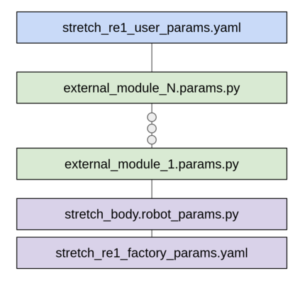

# Stretch Body: Parameters Tutorial

In this tutorial we will discuss how parameters are managed in Stretch Body and show examples of how to customize your robot by overriding parameters.

**Note**: This tutorial applies to Stretch Body version 0.1.x or greater.

## Overview

Stretch Body shares a global set of parameters across all of its Python [Devices](). A quick way to see what parameters are available are with the `stretch_params.py` tool:

```
stretch_params.py 
################################### Parameters for stretch-re1-1039 ######################################
Origin                                   Parameter                                     Value                        
----------------------------------------------------------------------------------------------------------
stretch_re1_factory_params.yaml          param.head_pan.req_calibration                   0                             
stretch_re1_factory_params.yaml          param.head_tilt.pwm_limit                       885                           
...
```

The tool display each parameter's value as well as which parameter file it was loaded from.

By grepping the tool's output you can query specific settings. For example, to query contact thresholds for the arm:

```bash
stretch_params.py | grep arm | grep contact_thresh
stretch_re1_factory_params.yaml           param.arm.contact_thresh_max_N          [-100, 100]                   
stretch_re1_factory_params.yaml           param.arm.contact_thresh_N              [-64.46241590881348, 66.51084520568847]
```

Now if you want to override the default contact thresholds for the arm, you could add the following to your `stretch_re1_user_params.yaml`:

```yaml
arm:
  contact_thresh_N: [-80.0,80.0]
```

Run the tool again and we see:

```bash
stretch_params.py | grep arm | grep contact_thresh
stretch_re1_factory_params.yaml           param.arm.contact_thresh_max_N          [-100, 100]                   
stretch_re1_factory_params.yaml           param.arm.contact_thresh_N              [-80, 80]
```

## Data Organization

Parameters' data sources may be either a Python dictionary or a YAML file. The robot's YAML files are found under `$HELLO_FLEET_PATH/$HELLO_FLEET_ID`. The Python dictionaries may come from any Python module on the Python path.

There are three types of parameters:

* Factory Parameters
  * `stretch_re1_factory_params.yaml `: These are common factory settings shared across RE1s as well as factory calibration data that is specific to your robot.
  * `stretch_body.robot_params.py`: These are common factory settings shared across RE1s that may be automatically updated over time as new versions of Stretch Body are released.
* External Parameters
  * `<external_module>.params.py`: These are parameters for devices outside of Stretch Body (such as the devices found in the Stretch Tool Share)
* User Parameters
  * `stretch_re1_user_params.yaml`: These are user customizations of the robot's settings

As shown below, the parameters are loaded into the `robot_params` dictionary in a specific order, starting with `stretch_re1_factory_params.yaml`. Loading of subsequent parameters overwrites earlier parameters. As such, the `stretch_re1_user_params.yaml` parameters can overwrite any factory parameters or external parameters. 





You can configure which parameters data sources are loaded, and their order, in your `stretch_re1_user_params.yaml`. For example:

```yaml
factory_params: stretch_re1_factory_params.yaml
params:
- stretch_tool_share.usbcam_wrist_v1.params
- stretch_tool_share.stretch_dex_wrist_beta.params
```

Here we see that the name of the factory parameters file is `stretch_re1_factory_params.yaml`. We also see that two external parameter sets will be loaded. In this example, the order of parameter precedence  would be:

1. `stretch_re1_user_params.yaml`
2. `stretch_tool_share.stretch_dex_wrist_beta.params.py`
3. `stretch_tool_share.usbcam_wrist_v1.params.py`
4. `stretch_body.robot_params.py`
5. `stretch_re1_factory_params.yaml`

## Working with Parameters Programmatically

Stretch Body is organized as a set of classes that extend the base [Device]() class. Each Device has access to a set of global parameters that are stored within the Device as a dictionary. These are:

* `device.params` : the parameters for the specific device
* `device.robot_params`: global set of parameters

For example, let's look at the Robot class:

```python
class Robot(Device):
    def __init__(self):
        Device.__init__(self,'robot')
        ...
```

When instantiating its Device base class it loads the robot parameters of the various YAML files and Python dictionaries.

```python
class Device:
    def __init__(self,name):
        self.name=name
        self.user_params, self.robot_params = RobotParams.get_params()
        try:
            self.params=self.robot_params[self.name]
        except KeyError:
            print('No device params found for %s'%name)
            self.params={}
```

We can explore these parameters via iPython. 

```python
import stretch_body.robot as robot

In [2]: r=robot.Robot()

In [3]: r.params
Out[3]: 
{'batch_name': 'Irma',
 'log_to_console': 0,
 'serial_no': 'stretch-re1-1039',
 'stow': {'arm': 0.0,
  'head_pan': 0.0,
  'head_tilt': 0.0,
  'lift': 0.2,
  'stretch_gripper': 0,
  'wrist_yaw': 3.4},
 'tool': 'tool_none',
 'use_arm': 1,
 'use_base': 1,
 'use_end_of_arm': 1,
 'use_head': 1,
 'use_lift': 1,
 'use_monitor': 1,
 'use_pimu': 1,
 'use_sentry': 1,
 'use_wacc': 1,
 'verbose': 0}

In [4]: r.arm.params
Out[4]: 
{'chain_pitch': 0.0167,
 'chain_sprocket_teeth': 10,
 'contact_thresh_N': [-80, 80],
 'contact_thresh_max_N': [-100, 100],
 'force_N_per_A': 55.9,
 'gr_spur': 3.875,
 'homing_force_N': [-60, 80],
 'i_feedforward': 0,
 'motion': {'default': {'accel_m': 0.14, 'vel_m': 0.14},
  'fast': {'accel_m': 0.2, 'vel_m': 0.25},
  'max': {'accel_m': 0.3, 'vel_m': 0.3},
  'slow': {'accel_m': 0.07, 'vel_m': 0.06}},
 'range_m': [0.0, 0.5202755326289126],
 'verbose': 0}

```

All devices have access the global parameter set, `robot_params`. For example, the arm can access the lift parameters:

```python
r.arm.robot_params['lift']
Out[7]: 
{'belt_pitch_m': 0.005,
 'contact_thresh_N': [-72.45217552185059, 65.6581787109375],
 'contact_thresh_max_N': [-100, 100],
 'force_N_per_A': 75.0,
 'homing_force_N': [-70, 70],
 'i_feedforward': 0.75,
 'motion': {'default': {'accel_m': 0.15, 'vel_m': 0.095},
  'fast': {'accel_m': 0.2, 'vel_m': 0.12},
  'max': {'accel_m': 0.3, 'vel_m': 0.15},
  'slow': {'accel_m': 0.05, 'vel_m': 0.05}},
 'pinion_t': 12,
 'range_m': [0.0, 1.0983598164609882],
 'verbose': 0}

```

You can set any of the `robot_params` pro grammatically. For example to adjust the contact sensitivity for the arm:

```python
In [9]: r.arm.params['contact_thresh_N']
Out[9]: [-64.46241590881348, 66.51084520568847]
    
In [10]: r.arm.params['contact_thresh_N']=[-80.0, 80.0]
```


