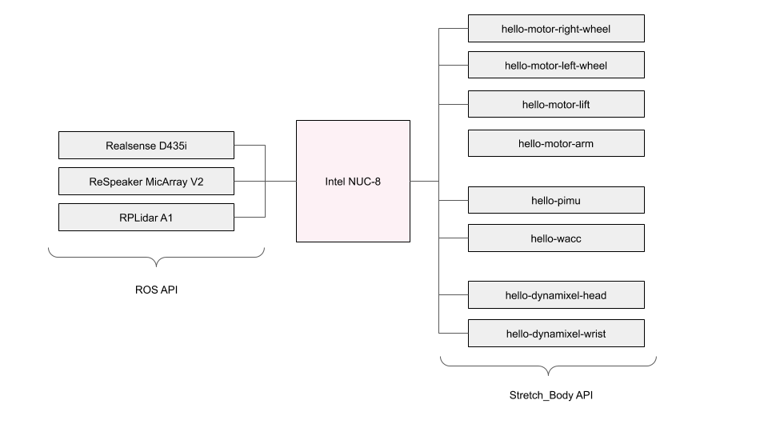

## Overview

In this tutorial you will gain a familiarity with the low level hardware of Stretch. See the <Stretch Hardware User Manual> for additional details on the hardware use.

## USB Devices

The robot hardware is almost entirely USB based. From a shell on your Stretch, check the available USB devices:

```bash
lsusb ...
```

## System Check

It is useful to periodically check that all robot hardware is present and operating correctly.  From the console, run:

```
robot_system_check.py
```

When everything is present and within normal operating conditions you should see an output similar to:

X

## Hardware Architecture

The organization of the primary hardware devices are shown below. Blue indicates a USB connection. 


The Stretch_Body package deals primarily with the robot actuators and interfaces to the robot's custom firmware. As shown below, the USB devices on the right-hand-side are handled through the Stretch_Body API. The other devices are handles through either ROS or Ubuntu. 

 

## Actuators

There are two types of actuators in the robot:

* A Nema-23 stepper actuator that includes current feedback and a hall-effect based encoder
* A Dynamixel X-Series servo that includes current feedback and a hall-effect based encoder

[Image dynamixel]

[Image Mechaduino]

The actuators include in most cases include a custom transmission on the output side of the closed loop servo controller. These transmission are of a low gear ratio (on the order of 4:1), allowing for excellent force sensitivity based on the actuator current feedback.

#### Steppers

First, take a minute to review the [Stepper Class](../python/stretch_body/stepper.py). This class directly interacts with the stepper motor and allows placing the actuator in a variety of control modes. Generally you would not use this class directly in your code, but instead would use the [Arm Class](../stretch_body/arm.py) , for example, when controlling the arm. The Arm Class incoporates joint limits, calibrates to joint units, and manages contact forces, etc. The Stepper Class, in contrast, provides raw access to the Stepper motor controller. 


Check the available stepper devices

```
ls /dev/hello-motor*
...
```

Let's directly jog the arm stepper.

```
stretch_arm_jog.py
```

Hit enter a few times and view the actuator state. Notice the position reported at the Arm level is in meters, while the position reported at the Stepper level is in radians. Also notice that the arm force being exterted, in Newtons, which is estimated based on the level of motor current.

```
x
```

Now jog the arm using the keyboard 'i' and 'o' comands to extend and retract.  Experiment with setting the joint speeds. Take a look at the code for [stretch_arm_jog.py](../bin/stretch_arm_jog.py). You can see that it is passing in velocity settings from the YAML.

Looking at the YAML for the arm you can see the motion parameters, as well as other parameters that handle the calibration for the joint.

```
arm:
  chain_pitch: 0.0167
  chain_sprocket_teeth: 10
  contact_thresh_N: [-50, 50]
  contact_thresh_max_N: [-80, 80]
  force_adj_Newtons: 1.35
  gr_spur: 3.875
  i_feedforward: 0
  motion:
    fast: {accel_m: 0.2, vel_m: 0.2}
    default: {accel_m: 0.14, vel_m: 0.14}
    max: {accel_m: 1.0, vel_m: 1.0}
    slow: {accel_m: 0.07, vel_m: 0.06}
  range_m: [0.0, 0.52]
```

You can also use [base_jog.py](../stretch_body/base_jog.py) and [lift_jog.py](../stretch_body/lift_jog.py) to move the other joints directly. Use care to avoid self collisions and collisions with the world when using these tools.

## Sensors

#### Pimu Board

#### Wacc Board