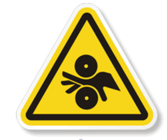
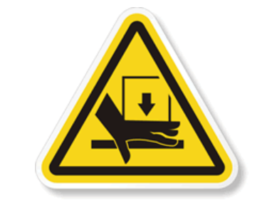
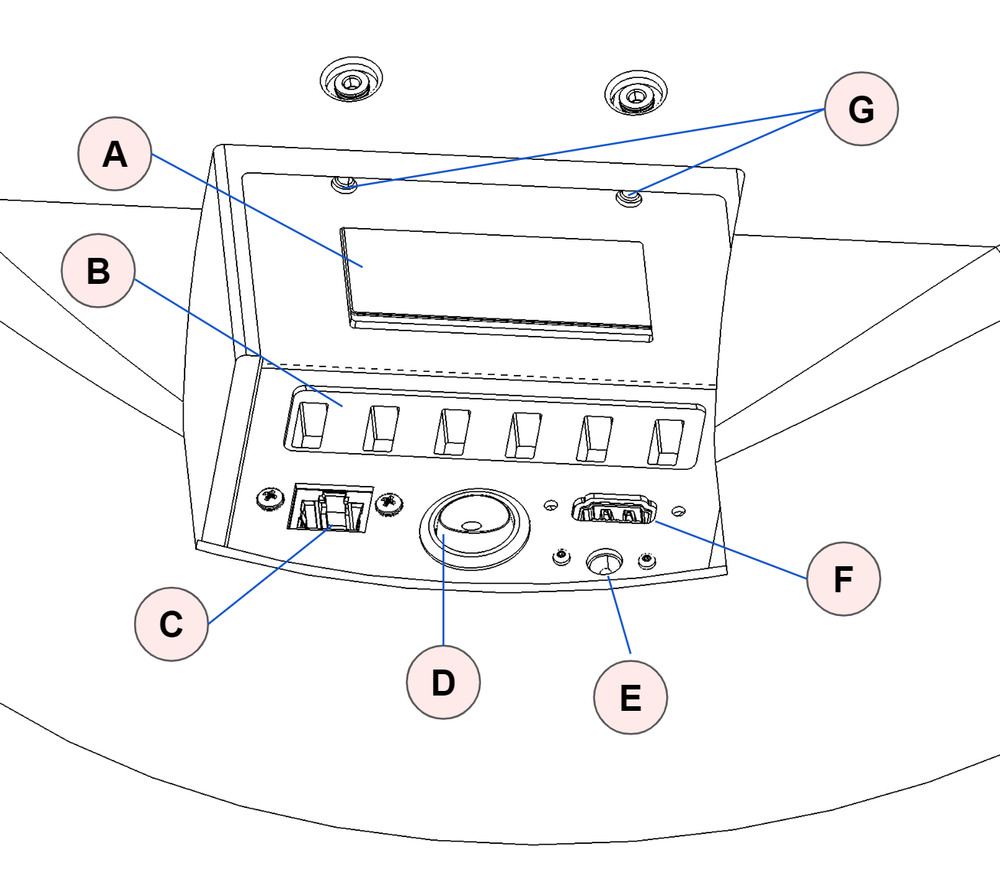
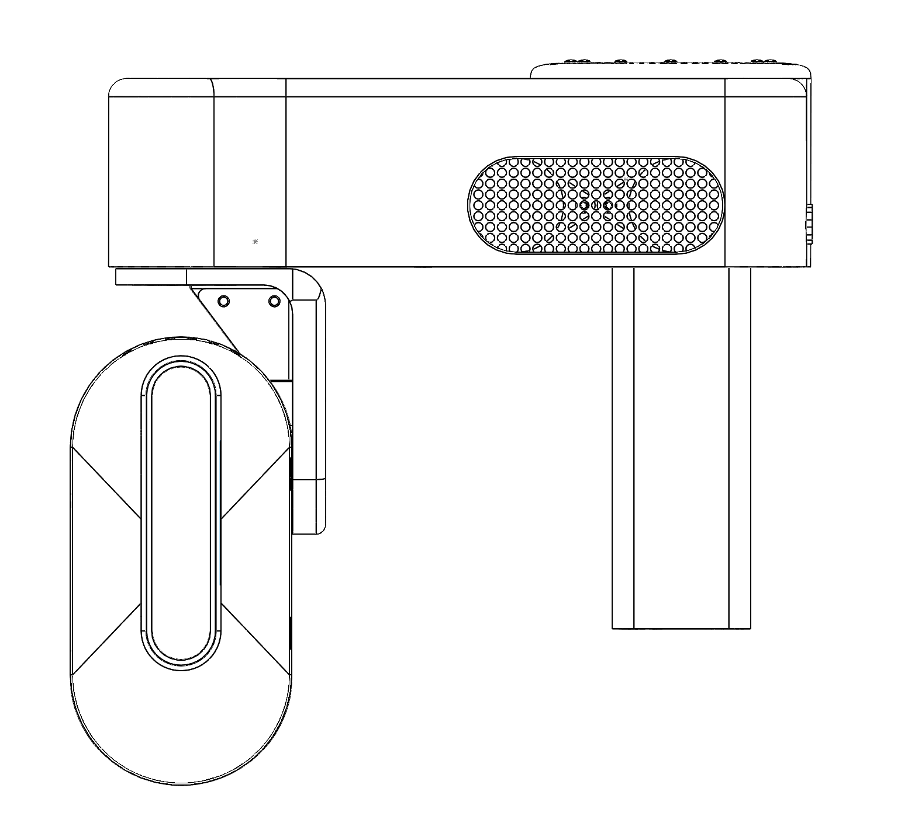
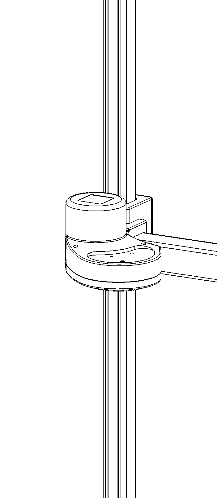
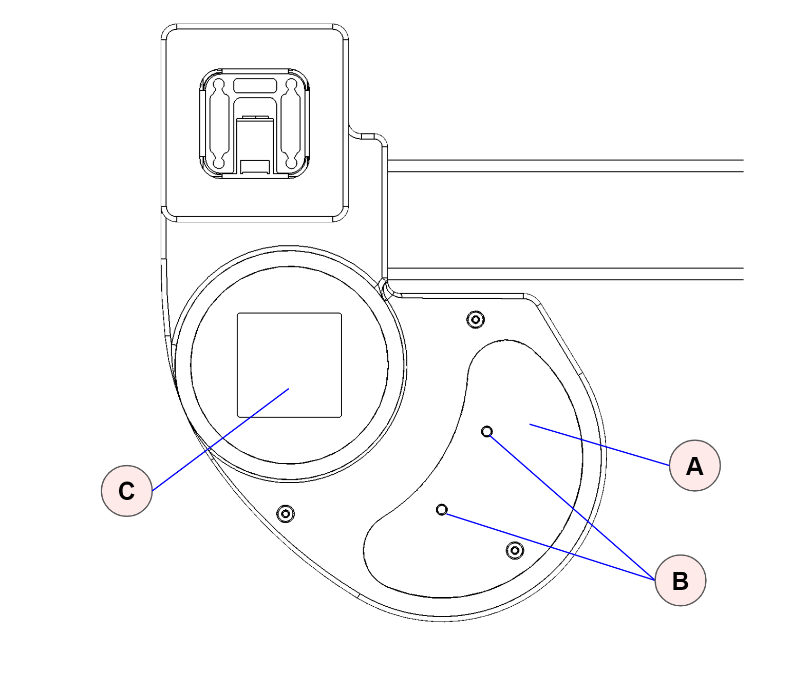
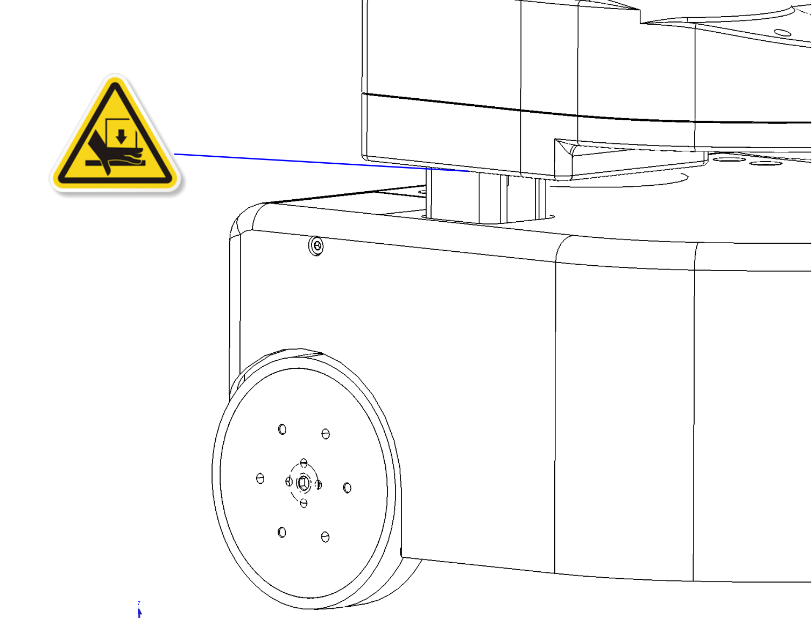
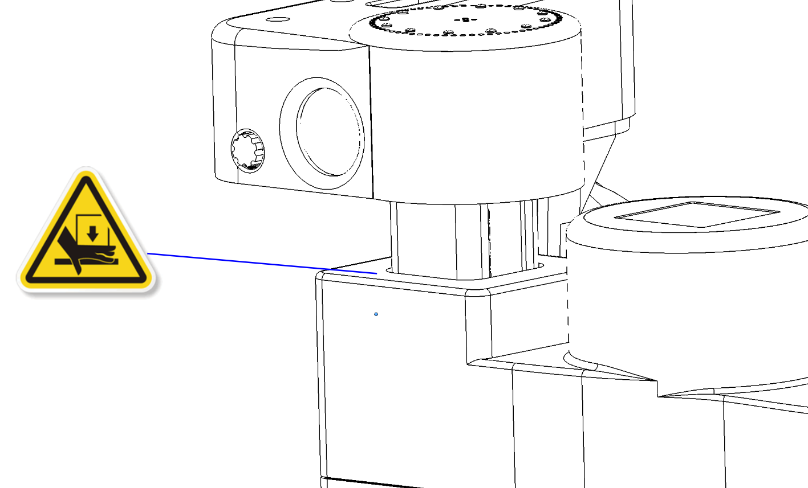

**User Guide - Stretch RE1**

* * *

**Revision 001**

**January 2020**

You may not use or facilitate the use of this document in connection with any infringement or other legal analysis concerning Hello Robot products described herein. 

No license (express or implied, by estoppel or otherwise) to any intellectual property rights is granted by this document. The products described may contain design defects or errors known as errata which may cause the product to deviate from published specifications. Current characterized errata are available on request. Hello Robot disclaims all express and implied warranties, including without limitation, the implied warranties of merchantability, fitness for a particular purpose, and non-infringement, as well as any warranty arising from course of performance, course of dealing, or usage in trade. All information provided here is subject to change without notice. 

Hello Robot is a trademark of Hello Robot Corporation in the U.S. and/or other countries. Copyright © 2020, Hello Robot Corporation. All Rights Reserved.

# Revision History

<table>
  <tr>
    <td>Revision 001</td>
    <td>January 2020</td>
    <td>Initial documentation release.</td>
  </tr>
</table>

# Contents

[[TOC]]

# Introduction

## Before You Start

This manual is intended to help users become familiar with standard operating practices and use of the Hello Robot Stretch RE1

All users should read and become familiar with the safe operating procedures set out in the [Safety Section](#heading=h.uusotozgpvjt) before operating the robot. All users must watch the Safety Video prior to operating the robot.

If you are setting up a Stretch for the first time please see the tutorial videos for unboxing Stretch and running Stretch for the first time.

## Disclaimer

The Hello Robot Stretch Robot is intended for use in the research of mobile manipulation applications by users experienced in the use and programming of research robots. This product is not intended for general use in the home by consumers, and lacks the required certifications for such use. Please see the section  [Regulatory Compliance](#heading=h.d66d1zc26q9m) for further details.

# Safety

## Avoid upper/lower bounds on lift collision

## Safety Overview

It is important for users to keep safety in mind at all times while operating a Hello Robot. When improperly used it is possible for users, bystanders, and property to become harmed. All new users of Hello Robot products should be trained by experienced personnel on best practices for safe operation and interaction with the robot. 

Because Stretch is a mobile manipulator with autonomous capabilities, it may move in unpredictable ways. It may carry potentially dangerous objects that can contact people in unexpected ways. While it is relatively lightweight and able to only exert moderate forces on the environment, dangerous conditions can still occur. 

The moving components of the robot pose dangers of pinching and crushing of body parts. People should always be aware and attentive to the motion and of Stretch robots.

## Safety Video

Coming soon.

## Safety Features

We have considered safety from the outset in the design of Stretch. While no robot is ever inherently safe, the following features should enhance the safe and enjoyable experience of working with the robot.

* **Lightweight design: **The overall mass of Stretch is 22Kg, and the majority of the mass is in the base. The carbon fiber arm and aluminum mast make for a remarkably lightweight upper body. While this reduces the risk of crushing, crushing injury can still occur and should be carefully monitored.

* **Gravity friendly**: The arrangement of Stretch’s manipulator means that it doesn’t have to counteract gravity on a larger lever arm. As a result, the motors and gearboxes are much lower torque and lower weight than a traditional robot manipulator, allowing us to avoid the often dangerous strong shoulder joints of robot arms.

* **Low gear ratio**: The primary joints of Stretch (base, lift, and arm) have low, gear-ratios (approx 5:1), allowing for backdriving of joints when powered off. A low gear-ratio also reduces the effective inertia of each joint, limiting the impacted force during undesired contacts with people and the environment.

* **Contact Sensitivity**: The four primary joints of Stretch (base, lift, and, arm) have contact sensitivity. We measure motor currents to estimate contact forces. Because Stretch is a low gear-ratio robot, current sensing provides a fairly sensitive measure of contact forces.

* **Firmware limits**: Motor torques are limited at the lowest level of the firmware to configured bounds.

* **Runstop**: The illuminated runstop button on Stretch’s head can be used to pause operation of the four primary joints (base, lift, and arm) of the robot when it is in motion. NOTE: This is not equivalent to an Emergency Stop found on industrial equipment and no safety guarantees are made by its function.

## Safety Considerations

Like all robots, Stretch has some areas that require extra attention for safe operation. 

* It is possible to topple over, particularly if the arm is raised up high and it pushes or pulls on the environment with sufficient force.

* The shoulder, which travels up and down on the lift, has a series of rollers that ride along the mast. While the shoulder shells can prevent large objects from getting pinched by the rollers, small and thin objects can be pulled into and crushed. Be especially careful with long hair and clothing around the shoulder rollers.

* When the arm is descending, and if contact detection does not trigger, a crushing force can be experienced between the arm and the top of the base.

* The arm, base, wrist, and gripper have some moderately sharp corners that can get snagged during motion.

## Use Common Sense

The most important aspect of safety with Stretch is to use common sense, including

* Do not operate unattended by an experienced operator

* Exhibit caution when operating around young children who may interact with it in unexpected ways

* Keep an eye on cords, rugs, and any other floor hazards as it drives

* Keep it at least 5 meters from ledges, curbs, stairs, and any other toppling hazard

* Keep long hair and clothes away from the moving components of the robot.

* Do not operate out doors

* Keep the robot dry and do not operate around liquids

* Do not attempt to ride the robot

* If the robot appears to be damaged, stop operation immediately

* Do not have the robot hold any sharp objects.

* Use two people to lift and carry the robot when needed

## Safety Markings

Stretch has the following safety markings:

Top of shoulder, indicating potential pinch point between rollers and mast:

Top of base, indicating potential pinch point between arm and base.

# Hardware Overview

## Functional Specification

## Base

The base is a two wheel differential drive with a passive Mecanum wheel for a caster.  It includes four cliff sensors to allow detection of stairs, thresholds, etc.

<table>
  <tr>
    <td></td>
    <td>Item</td>
    <td>Notes</td>
  </tr>
  <tr>
    <td>A</td>
    <td>Drive wheels</td>
    <td>4 inch diameter, urethane rubber shore 60A</td>
  </tr>
  <tr>
    <td>B</td>
    <td>Cliff sensors</td>
    <td>Sharp GP2Y0A51SK0F, Analog, range 2-15 cm</td>
  </tr>
  <tr>
    <td>C</td>
    <td>Mecanum wheel</td>
    <td>Diameter 50mm</td>
  </tr>
</table>

The base has 6 M4 threaded inserts available for mounting user accessories such as a tray. The mounting pattern is shown below.

## Trunk

Development and charge ports are at the back of the base in the trunk. The trunk cover slides into place vertically and is non-latching.

The trunk height has been designed to accommodate one or more USB based Intel Neural Compute Sticks.

Two mounting holes are provided inside the trunk. These allow the user to strain relief tethered cables (eg, HDMI and keyboard) during development. It is recommended to strain relief such cables to prevent accidental damage during base motion.

<table>
  <tr>
    <td></td>
    <td>Item</td>
    <td>Notes</td>
  </tr>
  <tr>
    <td>A</td>
    <td>Vent</td>
    <td>Intake vent for computer fan</td>
  </tr>
  <tr>
    <td>B</td>
    <td>6 Port USB Hub</td>
    <td>USB 3.0 , powered 5V/3A</td>
  </tr>
  <tr>
    <td>C</td>
    <td>Ethernet</td>
    <td>Connected to computer NIC</td>
  </tr>
  <tr>
    <td>D</td>
    <td>On/Off</td>
    <td>Robot power on / off. Switch is illuminated when on.</td>
  </tr>
  <tr>
    <td>E</td>
    <td>Charge</td>
    <td>Rated for upplied 12V/7A charger</td>
  </tr>
  <tr>
    <td>F</td>
    <td>HDMI</td>
    <td>Connected to computer HDMI</td>
  </tr>
  <tr>
    <td>G</td>
    <td>Mounting points</td>
    <td>M4 threaded holes</td>
  </tr>
</table>

## Head

The head provides the audio interface to the robot, a pan tilt depth camera, a runstop, as well as a developer interface to allow the addition of additional user hardware.

<table>
  <tr>
    <td></td>
    <td>Item</td>
    <td>Notes</td>
  </tr>
  <tr>
    <td>A</td>
    <td>Pan tilt depth camera</td>
    <td>Intel RealSense D435i
Two Dynamixel XL430-W250-T servos</td>
  </tr>
  <tr>
    <td>B</td>
    <td>Speakers</td>
    <td></td>
  </tr>
  <tr>
    <td>C</td>
    <td>Mounting holes</td>
    <td>2x M4 threaded, spacing 25mm</td>
  </tr>
  <tr>
    <td>D</td>
    <td>Developer Interface</td>
    <td>USB2.0-A with 5V@500mA fused 
JST XHP-2,  12V@3A fused
Pin 1: 12V
Pin 2: GND</td>
  </tr>
  <tr>
    <td>E</td>
    <td>Microphone array</td>
    <td>With programmable 12 RGB LED ring </td>
  </tr>
  <tr>
    <td>F</td>
    <td>Runstop</td>
    <td></td>
  </tr>
  <tr>
    <td>G</td>
    <td>Audio volume control</td>
    <td></td>
  </tr>
</table>

### Pan Tilt

The head pan-tilt unit utilizes two Dynamixel XL430-W250-T servos. It incorporates a small 25x25x10mm fan in order to ensure proper cooling of the servo and camera during dynamic repeated motions of the tilt DOF.

The nominal ‘zero’ position is of the head is shown below, along with the corresponding range of motion.

<table>
  <tr>
    <td>DOF</td>
    <td>Range (deg)</td>
    <td>Min(deg)</td>
    <td>Max (deg)</td>
  </tr>
  <tr>
    <td>Pan</td>
    <td>225</td>
    <td>-100 </td>
    <td>125</td>
  </tr>
  <tr>
    <td>Tilt</td>
    <td>115</td>
    <td>-25</td>
    <td>90</td>
  </tr>
</table>

### Runstop

The runstop allows the user to pause the motion of the four primary DOF (base, lift, and arm) by tapping the illuminated button on the head. When the runstop is enabled, these DOF are in a ‘Safety Mode’ that inhibits the motion controller at the firmware level. Disabling the runstop allows normal operation to resume.

The runstop logic is:

<table>
  <tr>
    <td>Action</td>
    <td>Runstop Initial state</td>
    <td>Runstop final state</td>
    <td>Button Illumination</td>
  </tr>
  <tr>
    <td>Robot startup</td>
    <td>N/A</td>
    <td>Disabled</td>
    <td>Solid</td>
  </tr>
  <tr>
    <td>Tap runstop button</td>
    <td>Disabled</td>
    <td>Enabled</td>
    <td>Flashing at 1Hz</td>
  </tr>
  <tr>
    <td>Hold down runstop button for >2s</td>
    <td>Enabled</td>
    <td>Disabled</td>
    <td>Solid</td>
  </tr>
</table>

The default behavior of the Safety Mode for each DOF is:

<table>
  <tr>
    <td>DOF</td>
    <td>Safety Mode Behavior</td>
    <td>Notes</td>
  </tr>
  <tr>
    <td>
Left wheel</td>
    <td>Freewheel</td>
    <td>Motor drive is powered off. Base can be backdriven manually by user. </td>
  </tr>
  <tr>
    <td>Right wheel</td>
    <td>Freewheel</td>
    <td>Motor drive is powered off. Base can be backdriven manually by user. </td>
  </tr>
  <tr>
    <td>Lift</td>
    <td>Float</td>
    <td>Motor drive is powered on and commanding current to motor that compensates for gravity (eg, float). Lift can be backdriven by the user.</td>
  </tr>
  <tr>
    <td>Arm</td>
    <td>Float</td>
    <td>Motor drive is powered off. Arm can be backdriven manually by user. </td>
  </tr>
</table>

## Lift

The lift degree of freedom provides vertical translation of the arm. It is driven by a closed loop stepper motor, providing smooth and precise motion through a low gear-ratio belt drive. The ‘shoulder’ includes two mounting holes and a small delivery tray.

<table>
  <tr>
    <td></td>
    <td>Item</td>
    <td>Notes</td>
  </tr>
  <tr>
    <td>A</td>
    <td>Delivery tray</td>
    <td></td>
  </tr>
  <tr>
    <td>B</td>
    <td>Mounting holes</td>
    <td>Threaded M4. Spacing 34.5 mm.</td>
  </tr>
  <tr>
    <td>C</td>
    <td>Aruco Tag</td>
    <td>Size 40x40 mm</td>
  </tr>
</table>

### Lift Safe Operation

The lift, while in motion, may trap or crush objects between the ‘shoulder’ and another surface. As such, best practices for lift safety should always be used when using the lift degree of freedom.  

The lift has a max theoretical strength of nearly 200N of linear force. In practice, this force is limited by the lift’s Guarded Move function, which places the lift in Safety Mode when the actuator forces exceed a threshold. Nominally, this threshold is around 80N but it can be configured in software. When enabled an operating as expected, the Guarded Move controller should keep contact forces within comfortable and safe levels. 

The diagrams below show the potential crush points at the top and bottom of the lift range of motion.

## Arm

## Wrist

## Gripper

# Computer Overview

## Default User Account

## Creating User Accounts

## Networking

# Software Overview

YAML Configuration

# Care

## Charging

## Batteries

## Maintenance

# Regulatory Compliance

# Mechanical Drawings

